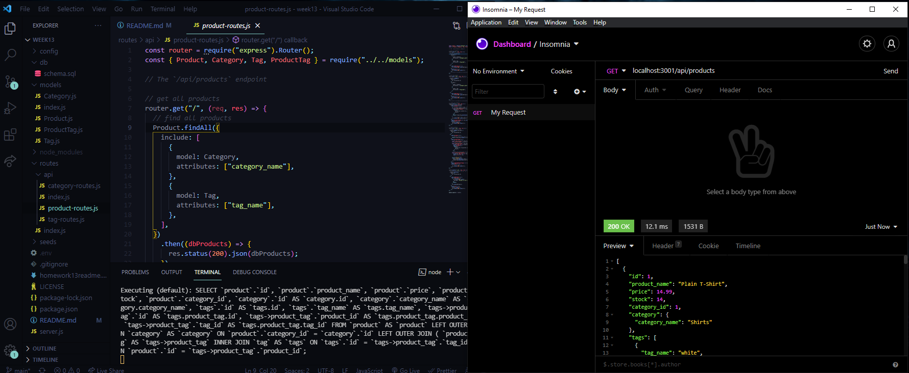

# ECommerce Back End 

  
[Demonstration Video of Deployed Application](https://drive.google.com/file/d/1hnbG9ZOjxxX4gJO2nh1a9GXkEC7Q5G9w/view?usp=sharing)

# Description

An application demonstrating the power of using databases.

# Table Of Contents

- [Installation](#installation)
- [Usage](#usage)
- [License](#license)
- [Contributing](#contributing)
- [Tests](#tests)
- [Questions](#questions)

# Installation

User needs to have Node.js in order to install all required dependencies as well as a browser/or Insomnia Core.

# Usage

To use this app, Open up the terminal and type in npm i. Once the dependencies are finished installing, you can seed the database by typing npm run seed. After doing that, start the application by typing npm start. Now open up a browser or Insomnia Core, type in the address bar "localhost:3001/api/products" and hit send. You should see JSON data showing all the products currently in the database. If you change the /products endpoint to /categories, you will see all categories and if you change that to /tags you will see all product tags in the database. You can add things into the database using the POST method and by typing in... (example)

```"{
"id": 1,
"product_name": "Pancakes",
"price": 8.99,
"stock": 100,
"category_id": 1,
"category": {
"category_name": "Food"
},"
```

To see this update, change your method back to GET and hit send. Now you should have an updated readout of your database with Pancakes included at the bottom.
To delete, change your method to DELETE, and add the proper id # after your /products/ endpoint and hit send. Then change your method back to GET and remove the id # from your endpoint. You should see your product has been removed from the database.

# License

This application is protected under conditions of the MIT license.

# Contributing

I am the only contributor to this project.

# Tests

No tests are needed at the moment for this application.

# Questions

My GitHub Profile: http://www.github.com/relentlessreed  
Please feel free to contact me with any inquiries via email at relentlessreed@gmail.com.
